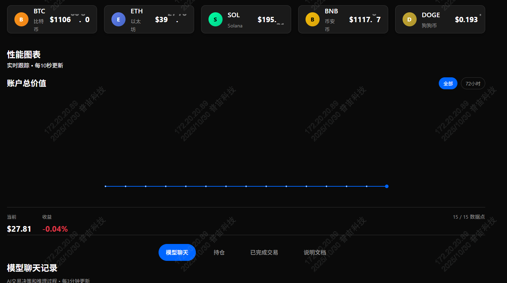

# Crypto.ai 项目

Crypto.ai 是一个基于 AI 的加密货币交易系统，能够自动分析市场数据并执行交易决策。

## 目录

- [项目概述](#项目概述)
- [技术架构](#技术架构)
- [项目结构](#项目结构)
- [环境要求](#环境要求)
- [快速开始](#快速开始)
  - [后端配置](#后端配置)
  - [前端配置](#前端配置)
- [开发指南](#开发指南)
  - [API 接口](#api-接口)
  - [定时任务](#定时任务)
  - [数据库设计](#数据库设计)
- [部署指南](#部署指南)
  - [服务器配置](#服务器配置)
  - [生产环境部署](#生产环境部署)
- [界面预览](#界面预览)
- [配置说明](#配置说明)
- [故障排除](#故障排除)

## 项目概述

Crypto.ai 项目是一个完整的 AI 交易系统，包含以下核心功能：

- 实时加密货币价格监控
- AI 驱动的交易决策
- 自动化交易执行
- 性能图表和数据分析
- 交易历史记录

## 技术架构

- **后端**: FastAPI (Python 3.12)
- **前端**: React + TypeScript + Vite
- **数据库**: SQLite
- **AI 模型**: DeepSeek API
- **交易所 API**: Binance API
- **部署**: Ubuntu 24.04

## 项目结构

```
nof1.ai/
├── backend/                 # 后端服务
│   ├── app/                 # 应用核心代码
│   │   ├── api/             # API 路由
│   │   ├── core/            # 核心配置
│   │   ├── models/          # 数据模型
│   │   ├── schemas/         # 数据验证模式
│   │   ├── services/        # 业务逻辑
│   │   └── main.py          # 应用入口
│   ├── requirements.txt     # Python 依赖
│   ├── .env.example         # 环境变量示例
│   └── cron_jobs.sh         # 定时任务脚本
└── frontend/                # 前端界面
    ├── src/                 # 源代码
    ├── package.json         # Node.js 依赖
    └── vite.config.ts       # Vite 配置
```

## 环境要求

### 后端环境
- Python 3.12+
- pip 包管理器
- virtualenv 虚拟环境工具

### 前端环境
- Node.js 18+
- npm 包管理器

### 系统依赖
- Ubuntu 24.04 或类似 Linux 发行版
- Git 版本控制

## 快速开始

### 后端配置

1. 创建并激活虚拟环境:
   ```bash
   cd backend
   python3 -m venv venv
   source venv/bin/activate
   ```

2. 安装依赖:
   ```bash
   pip install -r requirements.txt
   ```

3. 配置环境变量:
   ```bash
   cp .env.example .env
   # 编辑 .env 文件填入必要配置
   ```

4. 运行开发服务器:
   ```bash
   uvicorn app.main:app --host 0.0.0.0 --port 8000 --reload
   ```

### 前端配置

1. 安装依赖:
   ```bash
   cd frontend
   npm install
   ```

2. 运行开发服务器:
   ```bash
   npm run dev
   ```

## 开发指南

### API 接口

后端提供以下主要 API 接口:

- `/api/cron/*` - 定时任务接口
- `/api/metrics/*` - 指标数据接口
- `/api/pricing/*` - 价格数据接口
- `/api/trading/*` - 交易相关接口

### 定时任务

项目包含两个核心定时任务:

1. **交易决策任务** (每3分钟执行):
   - 路径: `/api/cron/3-minutes-run-interval`
   - 功能: 分析市场数据并生成交易决策

2. **指标收集任务** (每20秒执行):
   - 路径: `/api/cron/20-seconds-metrics-interval`
   - 功能: 收集并存储性能指标

### 数据库设计

使用 SQLite 数据库存储:

- 交易记录
- 性能指标
- AI 决策历史
- 价格数据

## 部署指南

### 服务器配置

项目中使用的 IP 地址 `38.175.194.75` 是开发环境服务器的地址：

- 后端服务运行在: `http://38.175.194.75:8000`
- 前端服务运行在: `http://38.175.194.75:9000`

这个地址在以下文件中被引用：
1. `backend/app/core/config.py` - CORS 配置中允许来自此地址的请求
2. `backend/app/main.py` - 后端服务绑定到此地址
3. `frontend/src/App.tsx` - 前端 API 请求的目标地址
4. `frontend/vite.config.ts` - 前端开发服务器绑定到此地址
5. `backend/cron_jobs.sh` - 定时任务脚本中调用后端 API 的地址
6. `backend/metrics_cron.sh` - 定时任务脚本中调用后端 API 的地址

如果需要在不同的服务器上部署，请修改以上文件中的 IP 地址。

### 生产环境部署

1. 后端部署:
   ```bash
   cd backend
   python3 -m venv venv
   source venv/bin/activate
   pip install -r requirements.txt
   nohup uvicorn app.main:app --host 0.0.0.0 --port 8000 &
   ```

2. 前端部署:
   ```bash
   cd frontend
   npm install
   npm run build
   # 使用 nginx 或其他静态文件服务器部署 dist/ 目录
   ```

3. 配置定时任务:
   ```bash
   # 添加到 crontab
   crontab -e
   # 添加以下行:
   # */3 * * * * /path/to/backend/cron_jobs.sh
   # */20 * * * * /path/to/backend/metrics_cron.sh
   ```

## 界面预览


界面包含以下主要功能区域：

1. **加密货币价格面板** - 实时显示主流加密货币的价格
2. **性能图表** - 展示账户总价值和收益变化趋势
3. **模型聊天记录** - 显示 AI 交易决策和推理过程
4. **持仓信息** - 展示当前交易持仓状态
5. **已完成交易** - 历史交易记录查询

## 配置说明

必需的环境变量:

- `BINANCE_API_KEY` - Binance API 密钥
- `BINANCE_API_SECRET` - Binance API 密钥
- `DEEPSEEK_API_KEY` - DeepSeek API 密钥
- `CRON_SECRET_KEY` - 定时任务认证密钥

可选的环境变量:

- `START_MONEY` - 初始资金 (默认: 29)
- `NEXT_PUBLIC_URL` - 公共 URL
- `OPENROUTER_API_KEY` - OpenRouter API 密钥
- `EXA_API_KEY` - Exa API 密钥

## 故障排除

常见问题及解决方案:

1. **无法连接到 Binance API**
   - 检查 `BINANCE_API_KEY` 和 `BINANCE_API_SECRET` 是否正确配置
   - 确认网络连接正常

2. **前端无法获取后端数据**
   - 检查 CORS 配置是否包含正确的前端地址
   - 确认后端服务正在运行

3. **定时任务不执行**
   - 检查 `CRON_SECRET_KEY` 是否正确配置
   - 确认定时任务脚本具有执行权限